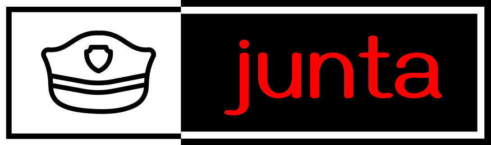

# junta

## Port Monitoring

The program continuously scans the server for new open ports and detects when a new port becomes accessible.

## User Authorization Monitoring

It monitors user authorization activities on the server and detects when new users are granted authorization or their permissions are modified.

## Program Execution Monitoring

The program keeps track of programs running on the server and identifies when a new program is executed or launched.

## Notification System

When any of the above events occur, the program sends you a notification or message to alert you about the event. This can be done through various communication channels such as email, SMS, or instant messaging.
